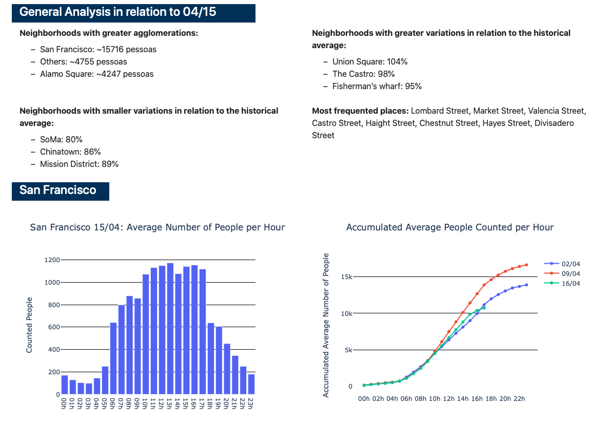
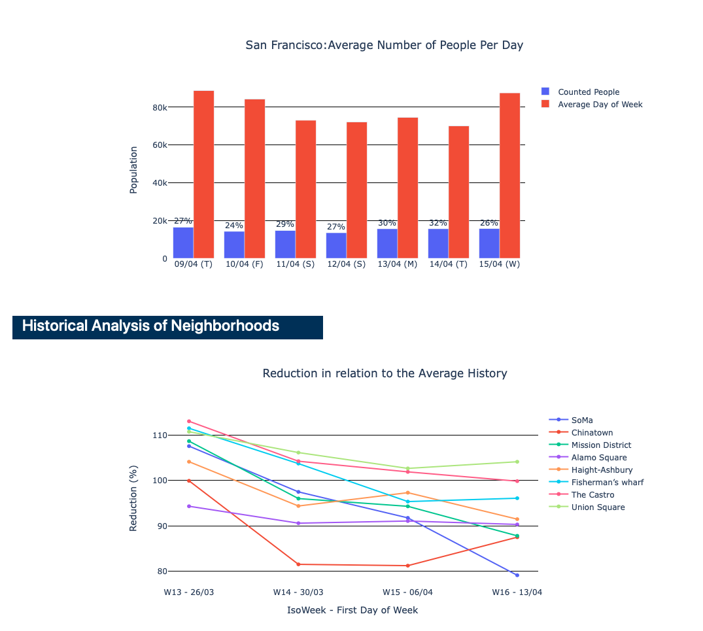

# Dashboard Web Appplication

A dashboard app example for building your own daily report. This webapp displays graphs for visual analysis and also a section with the most important informations of the daily report.

You can change the layout as you wish, the goal of this repository is to give you a starting point when building your daily report.

You can check the web app here:

https://dashboard-report-daily.herokuapp.com





## Usage

This is an open-source project, any feedback, improvement ideas, and contributors are welcome.

The data used to generate the results doesn't represent the reality.

- wranglings_scripts: Contains the data manipulations scripts used for analysis.
- dashboardapp: Flask App

## Installation

**Dependencies**

- Flask v1.1.2
- Jinja2 v2.11.1
- Pandas 1.0.3
- plotly v4.6.0

```
pip install -r requirements.txt
```

## Development

All contributors of all levels are welcome to help in any possible away. 

**Souce Code**

```
https://github.com/DanielDaCosta/people-count-dashboard.git
```

**TO DO**

The webapp is still on its early days and there are improvements to make. If you want to contribute to the project, you can start by addressing one of the items below:

- [ ] Add Dropdown-menu check box, to filter the results by Neighborhoods
- [ ] Add Dropdown-menu check box, to filter the results by date.
- [ ] Improve Layout

# Acknowledgements

- The webapp was deployed using [Heroku](https://dashboard.heroku.com).
